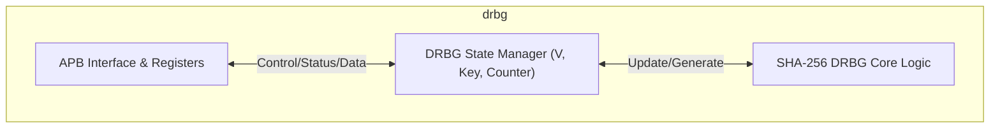
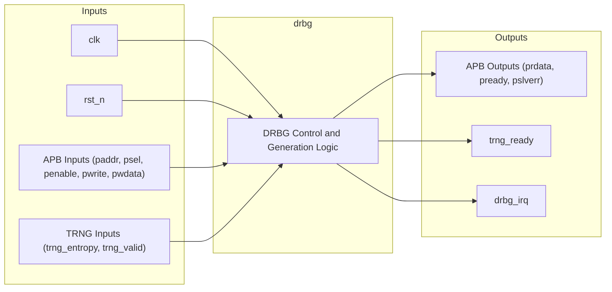

# HMAC-DRBG (Deterministic Random Bit Generator)

## Description

The `drbg` module implements a Deterministic Random Bit Generator (DRBG) based on the NIST SP 800-90A standard, utilizing SHA-256. It provides a secure mechanism for generating random numbers for cryptographic operations within the SMVDU-TITAN-X SoC. The core interfaces with a True Random Number Generator (TRNG) hardware block to acquire initial entropy for instantiation and subsequent reseeding. An APB slave interface exposes control and status registers, alongside 256 bits of generated output data, to the host system.

## Interface

### Inputs

| Signal | Width | Description |
|--------|-------|-------------|
| clk | 1 | System clock |
| rst_n | 1 | Active-low asynchronous reset |
| paddr | 32 | APB slave address bus |
| psel | 1 | APB slave select |
| penable | 1 | APB slave enable |
| pwrite | 1 | APB slave write enable |
| pwdata | 32 | APB slave write data |
| trng_entropy | 256 | 256-bit entropy input from hardware TRNG |
| trng_valid | 1 | Valid signal for TRNG entropy data |

### Outputs

| Signal | Width | Description |
|--------|-------|-------------|
| prdata | 32 | APB slave read data |
| pready | 1 | APB slave ready |
| pslverr | 1 | APB slave error |
| trng_ready | 1 | Ready signal to TRNG indicating DRBG is ready to accept entropy |
| drbg_irq | 1 | Interrupt request, asserted when DRBG operation is done |

## Functionality

The DRBG operates through a control register that commands instantiation, reseeding, and generation. Upon instantiation or reseeding, it waits for valid entropy from the TRNG to initialize or update its internal 256-bit Value (`V`) and Key registers. During generation, it updates its internal state and provides 256 bits of pseudo-random data accessible via eight 32-bit APB memory-mapped registers (`data_out`). The module tracks the number of generation requests using `reseed_counter` and raises a `need_reseed` status flag when the configured maximum limit (`MAX_RESEED_COUNT`) is reached. The `drbg_irq` is asserted when an operation (instantiate, generate, or reseed) completes.

## Hierarchical Block Diagram

## Signal-Level Diagram

