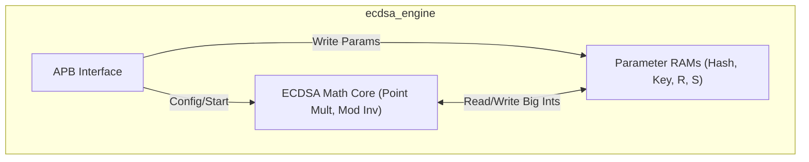
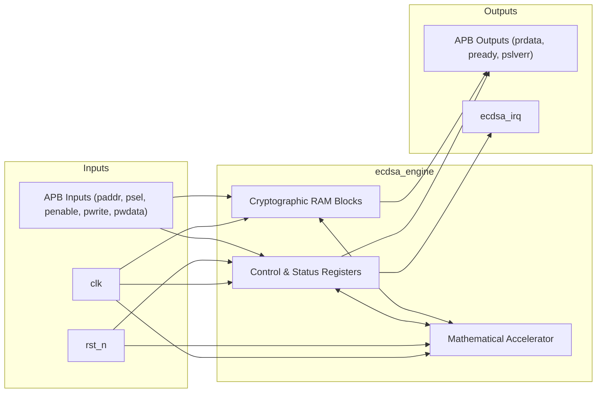

# ECDSA P-256/P-384 Engine

## Description

The `ecdsa_engine` module is a hardware accelerator dedicated to performing Elliptic Curve Digital Signature Algorithm (ECDSA) operations, specifically supporting P-256 and P-384 curves. This core offloads computationally intensive public-key cryptography operations, such as point multiplication and modular inversion, from the main CPU. It is controlled entirely via a 32-bit APB slave interface, which provides access to control/status registers as well as dedicated memory spaces for cryptographic parameters including message hashes, private/public keys, and signature components (R and S).

## Interface

### Inputs

| Signal | Width | Description |
|--------|-------|-------------|
| clk | 1 | System clock |
| rst_n | 1 | Active-low asynchronous reset |
| paddr | 32 | APB slave address bus |
| psel | 1 | APB slave select |
| penable | 1 | APB slave enable |
| pwrite | 1 | APB slave write enable |
| pwdata | 32 | APB slave write data |

### Outputs

| Signal | Width | Description |
|--------|-------|-------------|
| prdata | 32 | APB slave read data |
| pready | 1 | APB slave ready |
| pslverr | 1 | APB slave error |
| ecdsa_irq | 1 | Interrupt request, asserted when an ECDSA operation completes |

## Functionality

To utilize the engine, software writes the necessary large integers (up to 384 bits, mapped as arrays of 32-bit registers) into the designated memory regions: `hash_ram` for the message hash, `key_ram` for the key material, and `r_ram`/`s_ram` for the signature. The `ctrl_reg` configures the mode (P-256 or P-384) and the operation (sign or verify), and triggers the start of the computation. A state machine manages the multi-cycle mathematical operations. Once the simulated computation cycle count is reached, the core clears its busy flag, sets the done flag (and pass/fail flag for verification), and asserts the `ecdsa_irq` interrupt to notify the host processor.

## Hierarchical Block Diagram

## Signal-Level Diagram

