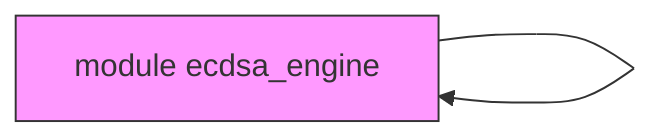
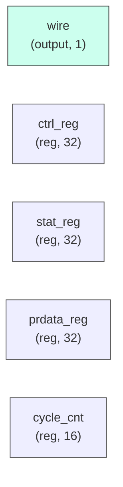

# ecdsa_engine

## Description

The **ecdsa_engine** module SPDX-License-Identifier: Apache-2.0
 SMVDU-TITAN-X SoC — ECDSA P-256/P-384 Engine
 Iteration 3: Hardware accelerator for Elliptic Curve Digital Signature Algorithm.
`timescale 1ns/1ps

## Interface

### Inputs

| Name | Width | Description |
|------|-------|-------------|
| wire | 1 | – |
| wire | 1 | – |
| wire | 1 | – |
| wire | 1 | – |
| wire | 1 | – |
| wire | 1 | – |
| wire | 1 | – |

### Outputs

| Name | Width | Description |
|------|-------|-------------|
| wire | 1 | – |
| wire | 1 | – |
| wire | 1 | – |
| wire | 1 | – |

## Functionality

*ecdsa_engine provides the hardware implementation for its designated function within the SoC.*

## Hierarchical Block Diagram (Mermaid)

## Full Signal‑Level Diagram (Mermaid)

