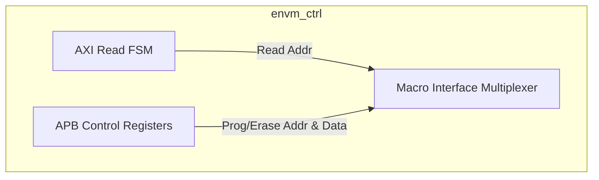
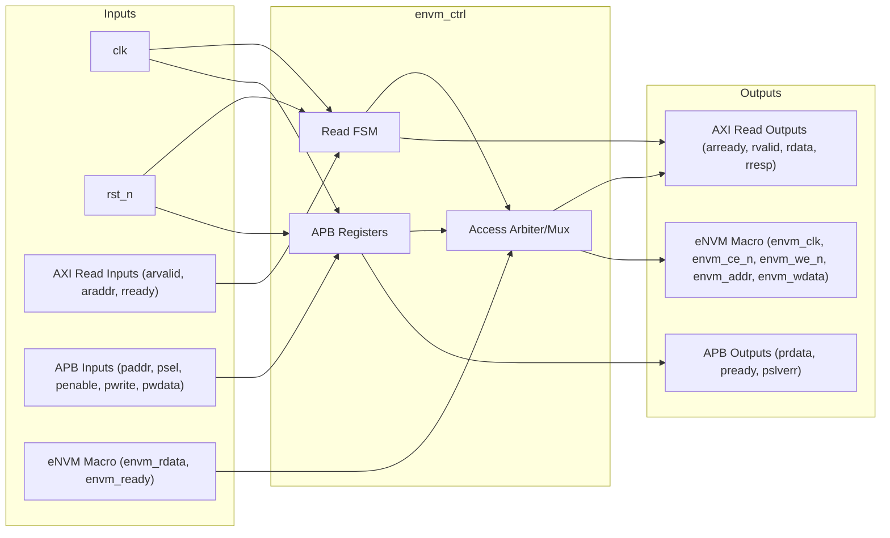

# eNVM Controller

## Description

The `envm_ctrl` module is the controller for a 128KB Embedded Non-Volatile Memory (eNVM) macro. It provides a dual-interface architecture: a high-speed AXI4-Lite slave interface optimized for fast, direct read access (typically used for instruction execution or boot ROM), and an APB slave interface dedicated to slower management operations such as programming and erasing memory sectors. It handles the translation of bus transactions into the specific physical control signals required by the underlying eNVM hardware macro.

## Interface

### Inputs

| Signal | Width | Description |
|--------|-------|-------------|
| clk | 1 | System clock |
| rst_n | 1 | Active-low asynchronous reset |
| s_arvalid | 1 | AXI4-Lite read address valid |
| s_araddr | AW | AXI4-Lite read address (AW=32) |
| s_rready | 1 | AXI4-Lite read data ready |
| paddr | 32 | APB slave address bus |
| psel | 1 | APB slave select |
| penable | 1 | APB slave enable |
| pwrite | 1 | APB slave write enable |
| pwdata | 32 | APB slave write data |
| envm_rdata | 32 | 32-bit read data from physical eNVM macro |
| envm_ready | 1 | Ready signal from physical eNVM macro |

### Outputs

| Signal | Width | Description |
|--------|-------|-------------|
| s_arready | 1 | AXI4-Lite read address ready |
| s_rvalid | 1 | AXI4-Lite read data valid |
| s_rdata | DW | AXI4-Lite read data (DW=32) |
| s_rresp | 2 | AXI4-Lite read response |
| prdata | 32 | APB slave read data |
| pready | 1 | APB slave ready |
| pslverr | 1 | APB slave error |
| envm_clk | 1 | Clock signal routed to eNVM macro |
| envm_ce_n | 1 | Active-low chip enable for eNVM macro |
| envm_we_n | 1 | Active-low write enable for eNVM macro |
| envm_addr | 17 | 17-bit physical word address to eNVM macro |
| envm_wdata | 32 | 32-bit write data to eNVM macro |

## Functionality

The controller arbitrates between read requests from the AXI bus and management commands from the APB bus, with AXI reads structurally given priority in this behavioral model. During an AXI read, the controller's simple FSM translates the `s_araddr` into the physical `envm_addr`, asserts `envm_ce_n`, and registers the returned `envm_rdata` to the AXI `s_rdata` bus, signaling completion via `s_rvalid`. The APB interface decodes accesses to a set of control registers (`cmd_reg`, `addr_reg`, `data_reg`, `unlock_reg`, and `stat_reg`). To program or erase the eNVM, software must write a specific magic value to the unlock register before issuing commands, mitigating accidental corruption of the non-volatile memory.

## Hierarchical Block Diagram

## Signal-Level Diagram

