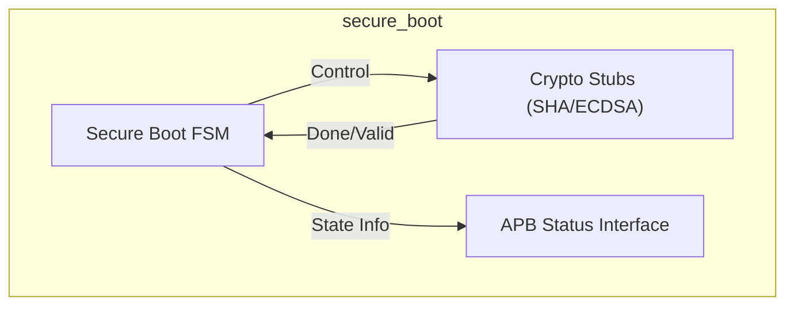
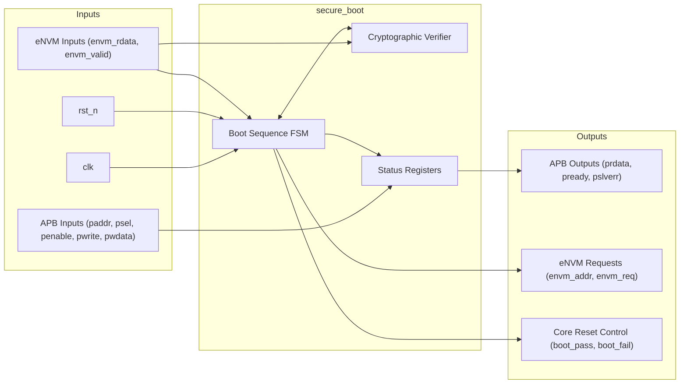

# Secure Boot Engine

## Description

The `secure_boot` module functions as the hardware root-of-trust for the SMVDU-TITAN-X SoC. Automatically triggered upon power-on reset, it enforces the authenticity and integrity of the initial boot image stored in eNVM. It achieves this by sequentially reading the firmware image, computing a SHA-256 hash, and verifying an attached ECDSA P-256 signature against a trusted public key. The main processor core is held in reset until this verification process successfully completes.

## Interface

### Inputs

| Signal | Width | Description |
|--------|-------|-------------|
| clk | 1 | System clock |
| rst_n | 1 | Active-low asynchronous reset |
| paddr | 32 | APB slave address bus |
| psel | 1 | APB slave select |
| penable | 1 | APB slave enable |
| pwrite | 1 | APB slave write enable |
| pwdata | 32 | APB slave write data |
| envm_rdata | 32 | 32-bit data read from eNVM |
| envm_valid | 1 | Valid signal indicating eNVM read data is ready |

### Outputs

| Signal | Width | Description |
|--------|-------|-------------|
| prdata | 32 | APB slave read data |
| pready | 1 | APB slave ready |
| pslverr | 1 | APB slave error |
| envm_addr | 17 | Direct word address output to eNVM controller |
| envm_req | 1 | Read request output to eNVM controller |
| boot_pass | 1 | Asserts to 1 to release the core reset on successful verification |
| boot_fail | 1 | Asserts to 1 to halt the system and signal a security failure |

## Functionality

The core operation is governed by a Finite State Machine (FSM). Immediately after reset (`IDLE`), it transitions to the `HASH_IMAGE` state where it asserts `envm_req` and iterates `envm_addr` to stream the boot image from the eNVM, passing it to an internal cryptographic hashing block (mocked in this iteration). Once hashing completes, it enters `READ_SIG` to fetch the 64-byte signature, followed by the `VERIFY` state where the ECDSA validation occurs. Depending on the cryptographic result, the FSM enters either `SUCCESS` (driving `boot_pass` high) or `HALT` (driving `boot_fail` high). A read-only APB interface is provided to allow a secure monitor core to inspect the FSM state or read potential error logs post-boot.

## Hierarchical Block Diagram

## Signal-Level Diagram

