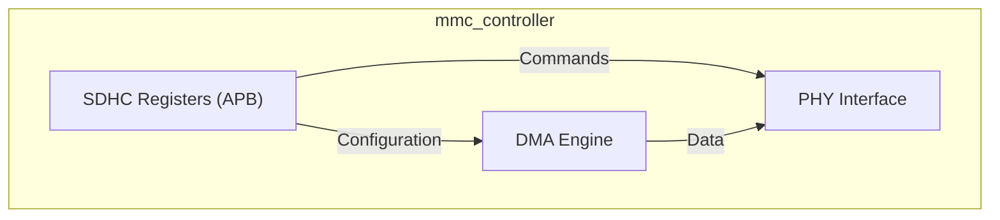
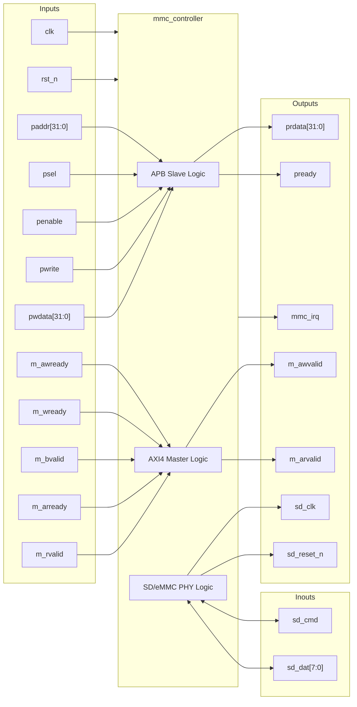

# mmc_controller

## Description

The `mmc_controller` module is an eMMC 5.1 / SD 3.0 Host Controller designed for the SMVDU-TITAN-X SoC. It facilitates block data transfers between system memory and SD/eMMC cards. The module integrates an AXI4 Master interface for scatter-gather DMA operations, allowing high-performance bulk data movement without CPU intervention. Configuration and control are managed via an APB slave interface that exposes standard SD Host Controller (SDHC) registers. It interfaces physically with the external SD or eMMC device through standard clock, command, and data lines.

## Interface

### Inputs

| Signal | Width | Description |
|--------|-------|-------------|
| clk | 1 | System clock |
| rst_n | 1 | Active-low asynchronous reset |
| m_awready | 1 | AXI4 Master write address ready - Indicates slave is ready to accept write address |
| m_wready | 1 | AXI4 Master write data ready - Indicates slave is ready to accept write data |
| m_bvalid | 1 | AXI4 Master write response valid - Indicates a valid write response is available |
| m_bresp | 2 | AXI4 Master write response - Indicates the status of the write transaction |
| m_bid | IDW | AXI4 Master write response ID - Identification tag for the write response |
| m_arready | 1 | AXI4 Master read address ready - Indicates slave is ready to accept read address |
| m_rvalid | 1 | AXI4 Master read data valid - Indicates valid read data is available |
| m_rdata | DW | AXI4 Master read data - The read data from the slave |
| m_rresp | 2 | AXI4 Master read response - Indicates the status of the read transaction |
| m_rlast | 1 | AXI4 Master read last - Indicates the last transfer in a read burst |
| m_rid | IDW | AXI4 Master read ID - Identification tag for the read data group |
| paddr | 32 | APB address bus - Target address for APB configuration transfers |
| psel | 1 | APB select - Indicates this APB slave is selected |
| penable | 1 | APB enable - Indicates the second and subsequent cycles of an APB transfer |
| pwrite | 1 | APB write access - Indicates a write transfer when high, read when low |
| pwdata | 32 | APB write data bus - Data to be written to configuration registers |

### Outputs

| Signal | Width | Description |
|--------|-------|-------------|
| m_awvalid | 1 | AXI4 Master write address valid - Indicates valid write address and control information |
| m_awaddr | AW | AXI4 Master write address - The address of the first transfer in a write burst |
| m_awid | IDW | AXI4 Master write address ID - Identification tag for the write address group |
| m_awlen | 8 | AXI4 Master write burst length - Exact number of transfers in a write burst |
| m_awsize | 3 | AXI4 Master write burst size - Size of each transfer in the write burst |
| m_wvalid | 1 | AXI4 Master write valid - Indicates valid write data and strobes |
| m_wdata | DW | AXI4 Master write data - The primary payload that is written to the slave |
| m_wstrb | DW/8 | AXI4 Master write strobes - Indicates which byte lanes hold valid data |
| m_wlast | 1 | AXI4 Master write last - Indicates the last transfer in a write burst |
| m_bready | 1 | AXI4 Master write response ready - Indicates master can accept a write response |
| m_arvalid | 1 | AXI4 Master read address valid - Indicates valid read address and control information |
| m_araddr | AW | AXI4 Master read address - The address of the first transfer in a read burst |
| m_arid | IDW | AXI4 Master read address ID - Identification tag for the read address group |
| m_arlen | 8 | AXI4 Master read burst length - Exact number of transfers in a read burst |
| m_arsize | 3 | AXI4 Master read burst size - Size of each transfer in the read burst |
| m_rready | 1 | AXI4 Master read ready - Indicates master can accept read data and response |
| prdata | 32 | APB read data bus - Read data returned from configuration registers |
| pready | 1 | APB ready - Indicates completion of an APB transfer |
| pslverr | 1 | APB slave error - Indicates an error during APB transfer (tied to 0) |
| mmc_irq | 1 | MMC interrupt request - Triggered on specific MMC events (currently tied to 0) |
| sd_clk | 1 | SD/eMMC clock - The serial clock for the physical SD/eMMC interface |
| sd_reset_n | 1 | SD/eMMC hardware reset - Active-low reset for the external SD/eMMC device |

### Inouts

| Signal | Width | Description |
|--------|-------|-------------|
| sd_cmd | 1 | SD/eMMC command line - Bidirectional command/response channel |
| sd_dat | 8 | SD/eMMC data lines - Bidirectional data channel (4-bit for SD, 8-bit for eMMC) |

## Functionality

The `mmc_controller` currently features a foundational register map compatible with standard SDHC specifications, accessed via the APB interface. The internal logic handles standard SDHC registers including `sdmasysad` (System Address), `blkattr` (Block Size & Count), `arg1` (Argument), and `trnmod_cmd` (Transfer Mode & Command). The AXI4 Master interface is intended for a DMA engine to perform large block transfers, while the PHY interface drives `sd_clk` and manages `sd_cmd` and `sd_dat` for physical communication. The current iteration contains stubs for DMA and PHY implementations, tying off DMA outputs and keeping PHY data lines in high-impedance states.

## Hierarchical Block Diagram

## Signal-Level Diagram

