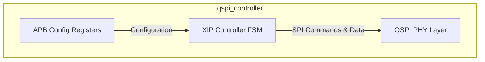
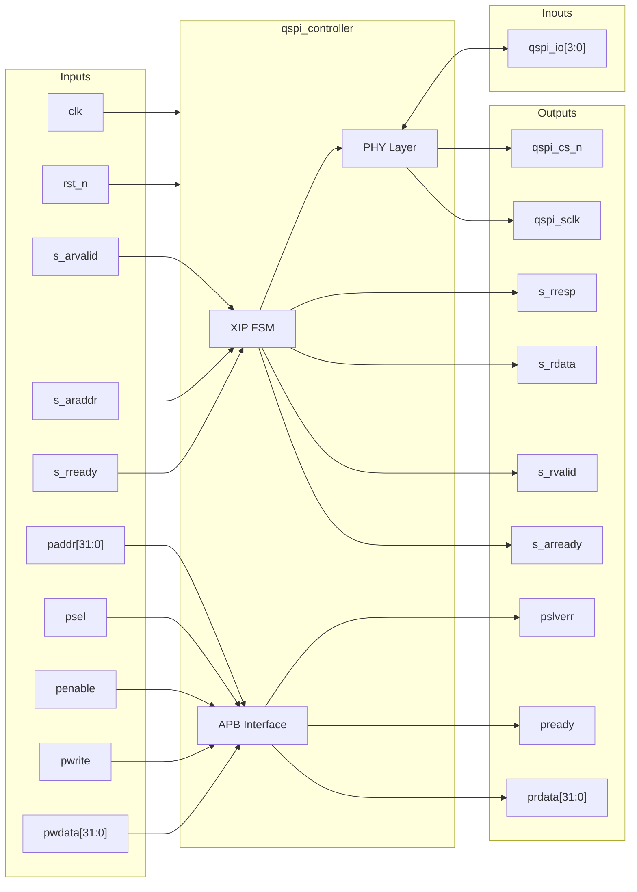

# qspi_controller

## Description

The `qspi_controller` is a Quad-SPI Controller for the SMVDU-TITAN-X SoC featuring Execute-in-Place (XIP) support. It interfaces with external flash memory over QSPI lines, permitting direct code execution without loading it into RAM first. The module utilizes an AXI4-Lite slave interface to accept read requests for XIP operations. Additionally, it offers an APB slave interface for configuring SPI parameters like CPOL, CPHA, and custom commands.

## Interface

### Inputs

| Signal | Width | Description |
|--------|-------|-------------|
| clk | 1 | System clock |
| rst_n | 1 | Active-low asynchronous reset |
| s_arvalid | 1 | AXI4-Lite Read address valid |
| s_araddr | AW | AXI4-Lite Read address |
| s_rready | 1 | AXI4-Lite Read data ready |
| paddr | 32 | APB address bus |
| psel | 1 | APB select |
| penable | 1 | APB enable |
| pwrite | 1 | APB write access |
| pwdata | 32 | APB write data bus |

### Outputs

| Signal | Width | Description |
|--------|-------|-------------|
| s_arready | 1 | AXI4-Lite Read address ready |
| s_rvalid | 1 | AXI4-Lite Read data valid |
| s_rdata | DW | AXI4-Lite Read data |
| s_rresp | 2 | AXI4-Lite Read response |
| prdata | 32 | APB read data bus |
| pready | 1 | APB ready |
| pslverr | 1 | APB slave error |
| qspi_sclk | 1 | QSPI serial clock |
| qspi_cs_n | 1 | QSPI chip select (active low) |

### Inouts

| Signal | Width | Description |
|--------|-------|-------------|
| qspi_io | 4 | QSPI bidirectional data lines |

## Functionality

The controller executes an internal Finite State Machine (FSM) to map incoming AXI4-Lite memory reads to standardized QSPI command sequences (e.g., Fast Read Quad I/O). The FSM transitions through IDLE, CMD (sending the read command opcode), ADDR (sending the read address), DUMMY (providing required dummy cycles for high-speed reads), READ (fetching actual data from the flash), and DONE states. Configurations set via the APB interface dictate parameters such as the command byte to use and the number of dummy cycles required by the external flash chip.

## Hierarchical Block Diagram

## Signal-Level Diagram

