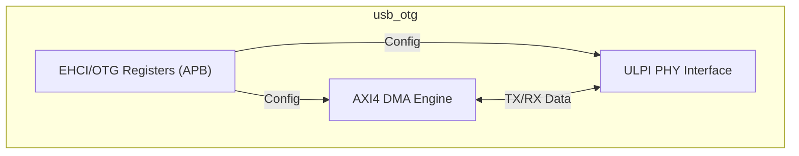
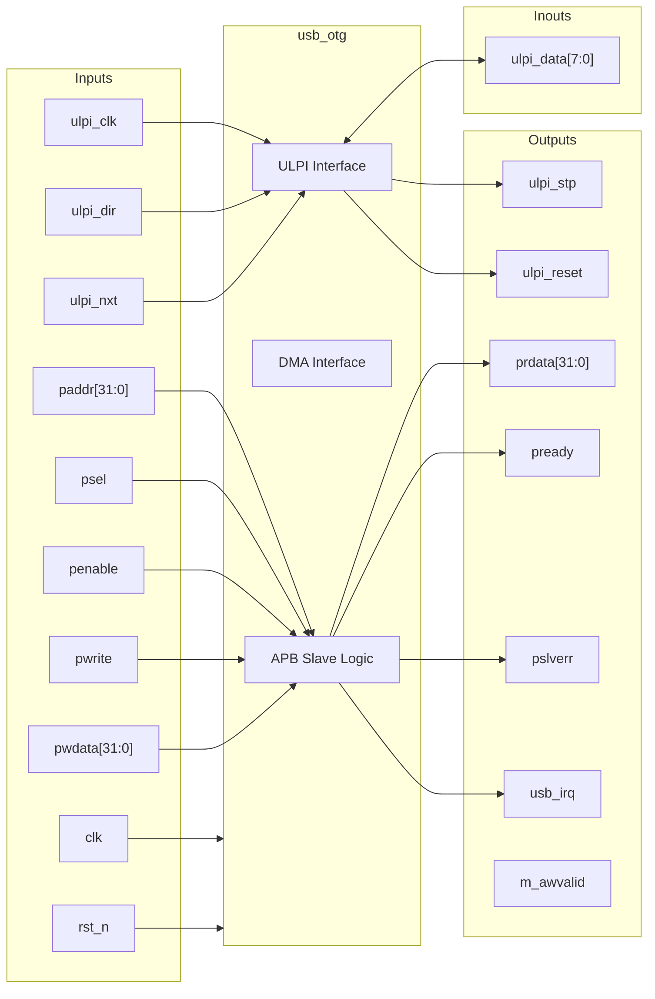

# usb_otg

## Description

The `usb_otg` module acts as a USB 2.0 On-The-Go (OTG) Controller with a UTMI+ Low Pin Interface (ULPI). It supports both Device and Host modes for dynamic role-switching in the SMVDU-TITAN-X SoC. The core manages data movement via an AXI4 Master interface employing scatter-gather DMA logic to transfer packets efficiently without processor intervention. Configuration and control use standard EHCI/OTG compatible registers accessible through an APB slave interface.

## Interface

### Inputs

| Signal | Width | Description |
|--------|-------|-------------|
| clk | 1 | System clock |
| rst_n | 1 | Active-low asynchronous reset |
| ulpi_clk | 1 | 60 MHz clock provided by the external ULPI PHY |
| ulpi_dir | 1 | ULPI direction - Dictates data flow on ulpi_data bus |
| ulpi_nxt | 1 | ULPI next - Flow control signal from PHY |
| m_awready | 1 | AXI4 Master write address ready |
| m_wready | 1 | AXI4 Master write data ready |
| m_bvalid | 1 | AXI4 Master write response valid |
| m_bresp | 2 | AXI4 Master write response status |
| m_bid | IDW | AXI4 Master write response ID |
| m_arready | 1 | AXI4 Master read address ready |
| m_rvalid | 1 | AXI4 Master read data valid |
| m_rdata | DW | AXI4 Master read data |
| m_rresp | 2 | AXI4 Master read response |
| m_rlast | 1 | AXI4 Master read last transfer |
| m_rid | IDW | AXI4 Master read ID |
| paddr | 32 | APB address bus |
| psel | 1 | APB select |
| penable | 1 | APB enable |
| pwrite | 1 | APB write access |
| pwdata | 32 | APB write data bus |

### Outputs

| Signal | Width | Description |
|--------|-------|-------------|
| ulpi_stp | 1 | ULPI stop - Flow control signal to PHY |
| ulpi_reset | 1 | ULPI reset - Active-high reset to the PHY |
| m_awvalid | 1 | AXI4 Master write address valid |
| m_awaddr | AW | AXI4 Master write address |
| m_awid | IDW | AXI4 Master write address ID |
| m_awlen | 8 | AXI4 Master write burst length |
| m_awsize | 3 | AXI4 Master write burst size |
| m_wvalid | 1 | AXI4 Master write valid |
| m_wdata | DW | AXI4 Master write data |
| m_wstrb | DW/8 | AXI4 Master write strobes |
| m_wlast | 1 | AXI4 Master write last |
| m_bready | 1 | AXI4 Master write response ready |
| m_arvalid | 1 | AXI4 Master read address valid |
| m_araddr | AW | AXI4 Master read address |
| m_arid | IDW | AXI4 Master read address ID |
| m_arlen | 8 | AXI4 Master read burst length |
| m_arsize | 3 | AXI4 Master read burst size |
| m_rready | 1 | AXI4 Master read ready |
| prdata | 32 | APB read data bus |
| pready | 1 | APB ready |
| pslverr | 1 | APB slave error |
| usb_irq | 1 | USB interrupt request |

### Inouts

| Signal | Width | Description |
|--------|-------|-------------|
| ulpi_data | 8 | ULPI bidirectional data bus |

## Functionality

The USB OTG controller manages register state for command, status, interrupts, asynchronous list addresses, port control, and OTG control logic via the APB interface. Interrupts are derived by logically combining the USB status (`usbsts`) and USB interrupt enable (`usbintr`) registers. To interact with the physical layer, the controller utilizes the ULPI interface synchronously running at 60MHz. Data transfer with the system is mocked to use the AXI4 Master interface for scatter-gather DMA, although the actual DMA and complete PHY logic are stubbed in the current design iteration. The data bus (`ulpi_data`) direction is determined by `ulpi_dir`.

## Hierarchical Block Diagram

## Signal-Level Diagram

