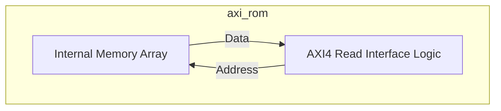
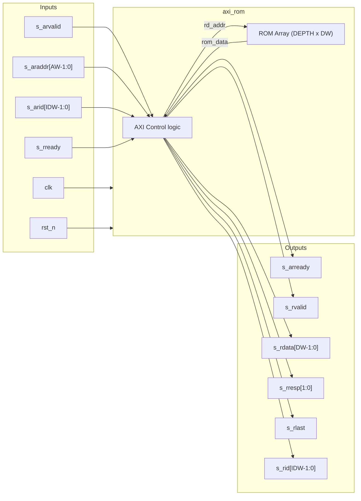

# axi_rom

## Description

The `axi_rom` module implements an AXI4 Read-Only Memory, primarily serving as the boot ROM for the SMVDU-TITAN-X SoC. It is mapped early in the memory space to provide the first instructions the processor cores fetch upon reset. This particular phase of the design utilizes a minimal stub populated with a RISC-V NOP sled (`ADDI x0, x0, 0`), guaranteeing that the CPU fetches cleanly without encountering faults if actual firmware is absent. However, it fully supports loading real bootloader firmware binaries via the `HEX_FILE` parameter or the `+hex` runtime simulation plusarg.

## Interface

### Inputs

| Signal | Width | Description |
|--------|-------|-------------|
| clk | 1 | System clock |
| rst_n | 1 | Active-low asynchronous reset |
| s_arvalid | 1 | AXI4 read address valid |
| s_araddr | AW | AXI4 read address |
| s_arid | IDW | AXI4 read address ID |
| s_rready | 1 | AXI4 read data ready |

### Outputs

| Signal | Width | Description |
|--------|-------|-------------|
| s_arready | 1 | AXI4 read address ready |
| s_rvalid | 1 | AXI4 read data valid |
| s_rdata | DW | AXI4 read data |
| s_rresp | 2 | AXI4 read response (Always OKAY) |
| s_rlast | 1 | AXI4 read last |
| s_rid | IDW | AXI4 read ID |

## Functionality

The ROM operates exclusively as an AXI4 slave, exposing only the read channels (AR and R). Internally, it implements a synchronous memory array indexed by the incoming AXI address (`s_araddr`). When an `s_arvalid` request is captured, it registers the address and ID, asserts `s_rvalid` and `s_rlast` on the following cycles, and outputs the requested 64-bit data word along with an OKAY `s_rresp`. Write channels (AW, W, B) are intentionally omitted to enforce its read-only nature at the hardware level.

## Memory & Firmware Files

| File | Format | Size | Description |
|------|--------|------|-------------|
| [`firmware.hex`](firmware.hex) | Verilog `$readmemh` Hex | 56 lines | Boot ROM firmware binary that executes upon reset at `0x1000_0000`, initializes the UART 16550 baud rate generator, and outputs the system boot banner (`TITAN-X Booting from 0x10000000...`) |
| [`boot.mem`](boot.mem) | Verilog `$readmemh` Mem | 85 lines | Primary software boot stage memory payload |

## Hierarchical Block Diagram

## Signal-Level Diagram

