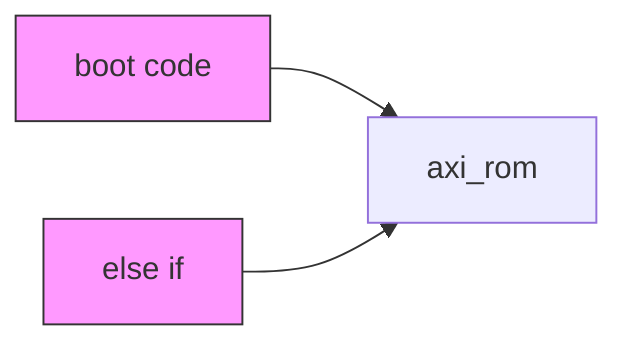
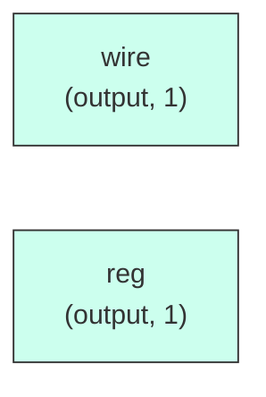

# axi_rom

## Description

The **axi_rom** module SPDX-License-Identifier: Apache-2.0
 TITAN-X SoC — AXI Read-Only Boot ROM
 Phase 5: Minimal stub with NOP sled + UART write sequence
`timescale 1ns/1ps

## Interface

### Inputs

| Name | Width | Description |
|------|-------|-------------|
| wire | 1 | – |
| wire | 1 | – |
| wire | 1 | – |
| wire | 1 | – |
| wire | 1 | – |
| wire | 1 | – |

### Outputs

| Name | Width | Description |
|------|-------|-------------|
| reg | 1 | – |
| reg | 1 | – |
| reg | 1 | – |
| wire | 1 | – |
| reg | 1 | – |
| reg | 1 | – |

## Functionality

*axi_rom provides the hardware implementation for its designated function within the SoC.*

## Hierarchical Block Diagram (Mermaid)

## Full Signal‑Level Diagram (Mermaid)

