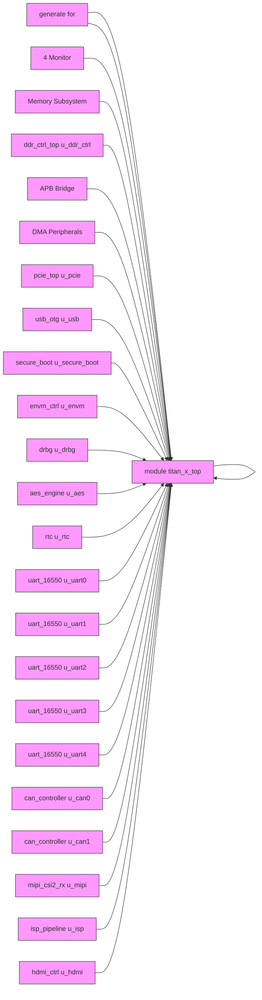

# titan_x_top

## Description

The **titan_x_top** module SPDX-License-Identifier: Apache-2.0
 SMVDU-TITAN-X SoC — System-on-Chip Top-Level Integration
 Generated by Integration Script

`timescale 1ns/1ps

## Interface

### Inputs

| Name | Width | Description |
|------|-------|-------------|
| wire | 1 | – |
| wire | 1 | – |
| wire | 1 | – |
| wire | 1 | – |
| wire | 1 | – |
| wire | 1 | – |
| wire | 1 | – |
| wire | 1 | – |
| wire | 1 | – |
| wire | 1 | – |
| wire | 1 | – |
| wire | 1 | – |

### Outputs

| Name | Width | Description |
|------|-------|-------------|
| wire | 1 | – |
| wire | 1 | – |
| wire | 1 | – |
| wire | 1 | – |
| wire | 1 | – |
| wire | 1 | – |
| wire | 1 | – |
| wire | 1 | – |
| wire | 1 | – |
| wire | 1 | – |
| wire | 1 | – |
| wire | 1 | – |
| wire | 1 | – |
| wire | 1 | – |
| wire | 1 | – |
| wire | 1 | – |
| wire | 1 | – |
| wire | 1 | – |
| wire | 1 | – |

## Functionality

*titan_x_top provides the hardware implementation for its designated function within the SoC.*

## Hierarchical Block Diagram (Mermaid)

## Full Signal‑Level Diagram (Mermaid)

```mermaid
graph LR
    classDef sig fill:#eef,stroke:#555,stroke-width:1px;
    classDef port fill:#cfe,stroke:#333,stroke-width:1px;
    wire["wire\n(input, 1)"]:::port
    wire["wire\n(input, 1)"]:::port
    wire["wire\n(output, 1)"]:::port
    wire["wire\n(output, 1)"]:::port
    wire["wire\n(output, 1)"]:::port
    wire["wire\n(output, 1)"]:::port
    wire["wire\n(output, 1)"]:::port
    wire["wire\n(output, 1)"]:::port
    wire["wire\n(output, 1)"]:::port
    wire["wire\n(output, 1)"]:::port
    wire["wire\n(output, 1)"]:::port
    wire["wire\n(output, 1)"]:::port
    wire["wire\n(output, 1)"]:::port
    wire["wire\n(output, 1)"]:::port
    wire["wire\n(output, 1)"]:::port
    wire["wire\n(inout, 1)"]:::port
    wire["wire\n(inout, 1)"]:::port
    wire["wire\n(inout, 1)"]:::port
    wire["wire\n(input, 1)"]:::port
    wire["wire\n(input, 1)"]:::port
    wire["wire\n(input, 1)"]:::port
    wire["wire\n(input, 1)"]:::port
    wire["wire\n(input, 1)"]:::port
    wire["wire\n(input, 1)"]:::port
    wire["wire\n(input, 1)"]:::port
    wire["wire\n(output, 1)"]:::port
    wire["wire\n(output, 1)"]:::port
    wire["wire\n(output, 1)"]:::port
    wire["wire\n(output, 1)"]:::port
    wire["wire\n(input, 1)"]:::port
    wire["wire\n(output, 1)"]:::port
    wire["wire\n(input, 1)"]:::port
    wire["wire\n(output, 1)"]:::port
    wire["wire\n(input, 1)"]:::port
    boot_pass["boot_pass\n(wire, 1)"]:::sig
    boot_fail["boot_fail\n(wire, 1)"]:::sig
    plic_irq["plic_irq\n(wire, 32)"]:::sig
    timer_irq["timer_irq\n(wire, 5)"]:::sig
    sw_irq["sw_irq\n(wire, 5)"]:::sig
    imem_arlen["imem_arlen\n(wire, 8)"]:::sig
    imem_arsize["imem_arsize\n(wire, 3)"]:::sig
    imem_arburst["imem_arburst\n(wire, 2)"]:::sig
    l2_dat_cs["l2_dat_cs\n(wire, 16)"]:::sig
    l2_dat_we["l2_dat_we\n(wire, 16)"]:::sig
    l2_dat_bank["l2_dat_bank\n(wire, 16)"]:::sig
    l2_dat_addr["l2_dat_addr\n(wire, 16)"]:::sig
    l2_dat_din["l2_dat_din\n(wire, 16)"]:::sig
    l2_dat_dout["l2_dat_dout\n(wire, 16)"]:::sig
    l2_dat_dout_valid["l2_dat_dout_valid\n(wire, 1)"]:::sig
    haddr["haddr\n(wire, 32)"]:::sig
    hwdata["hwdata\n(wire, 32)"]:::sig
    hrdata["hrdata\n(wire, 32)"]:::sig
    hwrite["hwrite\n(wire, 1)"]:::sig
    hready["hready\n(wire, 1)"]:::sig
    hresp["hresp\n(wire, 1)"]:::sig
    htrans["htrans\n(wire, 2)"]:::sig
    hsize["hsize\n(wire, 3)"]:::sig
    hburst["hburst\n(wire, 3)"]:::sig
    paddr["paddr\n(wire, 32)"]:::sig
    pwdata["pwdata\n(wire, 32)"]:::sig
    prdata_mux["prdata_mux\n(wire, 64)"]:::sig
    psel["psel\n(wire, 1)"]:::sig
    penable["penable\n(wire, 1)"]:::sig
    pwrite["pwrite\n(wire, 1)"]:::sig
    prdata_uart0["prdata_uart0\n(wire, 32)"]:::sig
    prdata_uart1["prdata_uart1\n(wire, 32)"]:::sig
    prdata_uart2["prdata_uart2\n(wire, 32)"]:::sig
    prdata_uart3["prdata_uart3\n(wire, 32)"]:::sig
    prdata_uart4["prdata_uart4\n(wire, 32)"]:::sig
    prdata_rtc["prdata_rtc\n(wire, 32)"]:::sig
    prdata_gem["prdata_gem\n(wire, 32)"]:::sig
    prdata_usb["prdata_usb\n(wire, 32)"]:::sig
    prdata_mipi["prdata_mipi\n(wire, 32)"]:::sig
    prdata_isp["prdata_isp\n(wire, 32)"]:::sig
    prdata_hdmi["prdata_hdmi\n(wire, 32)"]:::sig
    prdata_drbg["prdata_drbg\n(wire, 32)"]:::sig
    prdata_aes["prdata_aes\n(wire, 32)"]:::sig
    prdata_envm["prdata_envm\n(wire, 32)"]:::sig
    prdata_boot["prdata_boot\n(wire, 32)"]:::sig
    prdata_can0["prdata_can0\n(wire, 32)"]:::sig
    prdata_can1["prdata_can1\n(wire, 32)"]:::sig
    trng_seed_valid["trng_seed_valid\n(wire, 1)"]:::sig
    trng_seed["trng_seed\n(wire, 128)"]:::sig
    envm_addr["envm_addr\n(wire, 32)"]:::sig
    envm_req["envm_req\n(wire, 1)"]:::sig
    envm_rdata["envm_rdata\n(wire, 32)"]:::sig
    envm_valid["envm_valid\n(wire, 1)"]:::sig
    isp_tdata["isp_tdata\n(wire, 32)"]:::sig
    isp_tvalid["isp_tvalid\n(wire, 1)"]:::sig
    isp_tlast["isp_tlast\n(wire, 1)"]:::sig
    isp_tuser["isp_tuser\n(wire, 1)"]:::sig
    isp_tready["isp_tready\n(wire, 1)"]:::sig
```

