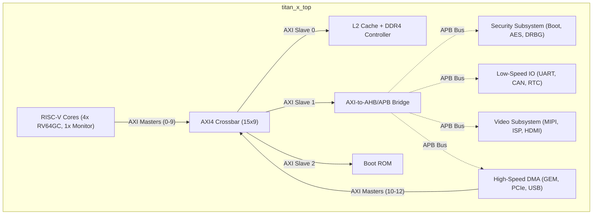
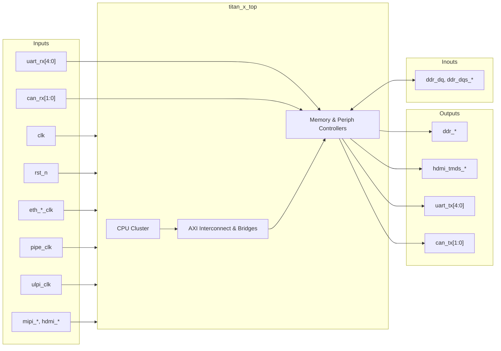

# titan_x_top

## Description

The `titan_x_top` module serves as the top-level System-on-Chip (SoC) integration module for the SMVDU-TITAN-X project. It instantiates, interconnects, and orchestrates the entire system architecture, anchoring a multicore RISC-V compute cluster (four RV64GC cores and an RV64IMAC monitor core) to a massive high-speed communication backbone via a 15-Master, 9-Slave AXI4 crossbar. It embeds extensive peripheral subsystems, including a DDR4 Memory Controller, high-speed interfaces (Gigabit Ethernet, PCIe, USB OTG), a multimedia and video subsystem (MIPI CSI-2, ISP, HDMI, VDMA), low-speed I/O (UARTs, RTC, CAN), and a dedicated Secure Boot and Cryptographic engine (AES, DRBG).

## Interface

### Inputs

| Signal | Width | Description |
|--------|-------|-------------|
| clk | 1 | Main system clock |
| rst_n | 1 | Main active-low system reset |
| pipe_clk | 1 | PCIe PHY interface clock |
| eth_tx_clk | 1 | Ethernet transmit clock |
| eth_rx_clk | 1 | Ethernet receive clock |
| ulpi_clk | 1 | USB ULPI PHY clock |
| mipi_rxbyteclkhs | 1 | MIPI CSI-2 high-speed byte clock |
| hdmi_clk_pixel | 1 | HDMI pixel clock |
| hdmi_clk_tmds | 1 | HDMI TMDS serial clock |
| rtc_clk | 1 | Real-Time Clock reference clock |
| uart_rx | 5 | UART receive lines (5 channels) |
| can_rx | 2 | CAN receive lines (2 channels) |

### Outputs

| Signal | Width | Description |
|--------|-------|-------------|
| ddr_addr | 16 | DDR4 Address bus |
| ddr_ba | 3 | DDR4 Bank address |
| ddr_bg | 2 | DDR4 Bank group |
| ddr_ck_p | 1 | DDR4 Differential clock positive |
| ddr_ck_n | 1 | DDR4 Differential clock negative |
| ddr_cke | 1 | DDR4 Clock enable |
| ddr_cs_n | 1 | DDR4 Chip select (active-low) |
| ddr_ras_n | 1 | DDR4 Row address strobe (active-low) |
| ddr_cas_n | 1 | DDR4 Column address strobe (active-low) |
| ddr_we_n | 1 | DDR4 Write enable (active-low) |
| ddr_reset_n | 1 | DDR4 Reset (active-low) |
| ddr_odt | 1 | DDR4 On-die termination |
| ddr_act_n | 1 | DDR4 Activation command |
| hdmi_tmds_clk_p | 1 | HDMI TMDS differential clock positive |
| hdmi_tmds_clk_n | 1 | HDMI TMDS differential clock negative |
| hdmi_tmds_data_p | 3 | HDMI TMDS differential data positive |
| hdmi_tmds_data_n | 3 | HDMI TMDS differential data negative |
| uart_tx | 5 | UART transmit lines (5 channels) |
| can_tx | 2 | CAN transmit lines (2 channels) |

### Inouts

| Signal | Width | Description |
|--------|-------|-------------|
| ddr_dq | 64 | DDR4 Bidirectional data bus |
| ddr_dqs_p | 8 | DDR4 Differential data strobes positive |
| ddr_dqs_n | 8 | DDR4 Differential data strobes negative |

## Functionality

The top module manages the massive AXI interconnect topology. The five RISC-V cores act as the primary masters (occupying ports 0 through 9 for instruction and data fetches). High-speed DMA peripherals (Ethernet, PCIe, USB OTG) operate as masters 10, 11, and 12. These masters address various slaves: Slave 0 routes through the L2 cache to the DDR4 memory controller; Slave 1 routes to an AXI-to-AHB/APB bridge decoding addresses for all memory-mapped peripherals (UART, CAN, RTC, Security, Video configs); Slave 2 maps the read-only Boot ROM. It seamlessly passes interrupts generated by individual peripherals up to the Platform-Level Interrupt Controller (PLIC) routed to the cores, whilst executing a boot validation sequence (`secure_boot`) that holds the core resets low until memory validity is verified.

## Hierarchical Block Diagram

## Signal-Level Diagram

