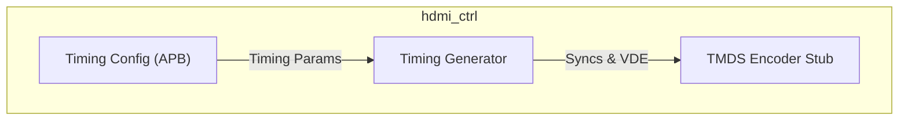
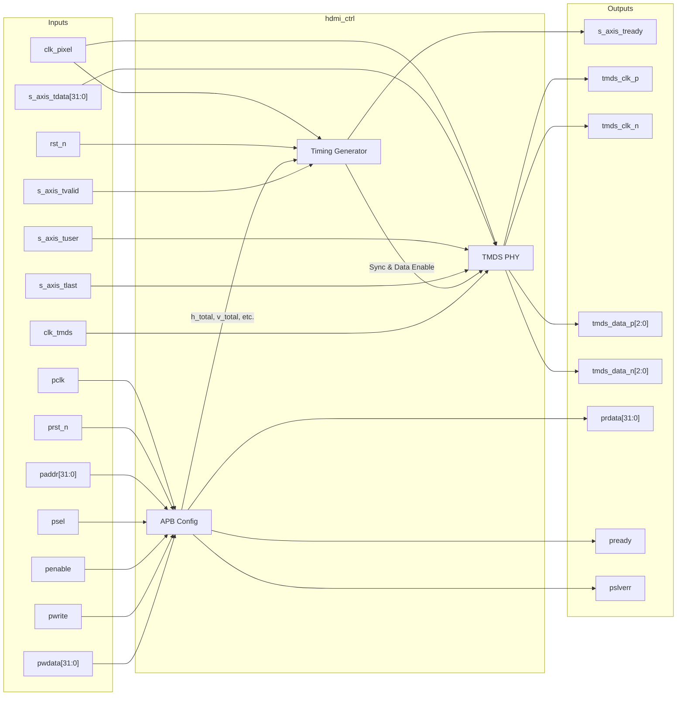

# hdmi_ctrl

## Description

The `hdmi_ctrl` module is an HDMI 1.4 Display Controller designed for the SMVDU-TITAN-X SoC. It is responsible for receiving raw pixel data via an AXI4-Stream interface (typically from a Video DMA engine) and generating the appropriate video timing signals. The controller internally synthesizes horizontal and vertical synchronization signals alongside the video data enable (VDE) signal. These signals, combined with the RGB pixel data, are subsequently passed to a TMDS encoder stub intended to drive the HDMI physical layer. Configurable timing parameters are managed through an APB interface.

## Interface

### Inputs

| Signal | Width | Description |
|--------|-------|-------------|
| clk_pixel | 1 | Pixel clock - Defines the rate of video data (e.g. 74.25 MHz for 720p) |
| clk_tmds | 1 | TMDS clock - Typically 10x the pixel clock for high-speed serialization |
| rst_n | 1 | Active-low asynchronous reset |
| s_axis_tdata | 32 | AXI4-Stream incoming pixel data (RGB 8:8:8 formatted) |
| s_axis_tvalid | 1 | AXI4-Stream incoming valid - Indicates valid pixel data |
| s_axis_tuser | 1 | AXI4-Stream user signal - Marks the Start of Frame (SOF) |
| s_axis_tlast | 1 | AXI4-Stream last signal - Marks the End of Line (EOL) |
| pclk | 1 | APB clock for configuration registers |
| prst_n | 1 | Active-low APB reset |
| paddr | 32 | APB address bus |
| psel | 1 | APB select |
| penable | 1 | APB enable |
| pwrite | 1 | APB write access |
| pwdata | 32 | APB write data bus |

### Outputs

| Signal | Width | Description |
|--------|-------|-------------|
| s_axis_tready | 1 | AXI4-Stream ready - Indicates readiness to accept pixel data |
| tmds_clk_p | 1 | TMDS differential clock positive |
| tmds_clk_n | 1 | TMDS differential clock negative |
| tmds_data_p | 3 | TMDS differential data positive (3 channels) |
| tmds_data_n | 3 | TMDS differential data negative (3 channels) |
| prdata | 32 | APB read data bus |
| pready | 1 | APB ready |
| pslverr | 1 | APB slave error |

## Functionality

The controller features an APB slave that stores video timing parameters for the display, allowing software to configure custom resolutions (e.g., 720p or 1080p). The built-in Timing Generator runs on the `clk_pixel` domain, incrementing horizontal and vertical counters up to their configured totals to create accurate horizontal sync (`hsync_reg`), vertical sync (`vsync_reg`), and video data enable (`vde_reg`) signals. The module uses the `vde_reg` signal to stall or fetch from the upstream AXI4-Stream pixel source. Finally, it interfaces with a TMDS encoder (currently stubbed) to convert 8-bit R, G, and B channel data plus syncs into standard 10-bit serialized TMDS sequences output on `tmds_data_p/n`.

## Hierarchical Block Diagram

## Signal-Level Diagram

