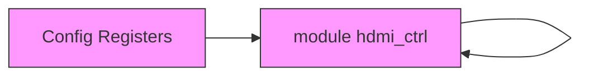

# hdmi_ctrl

## Description

The **hdmi_ctrl** module SPDX-License-Identifier: Apache-2.0
 SMVDU-TITAN-X SoC — HDMI 1.4 Display Controller
 Iteration 3: Receives AXI4-Stream pixels, generates HDMI timing, and TMDS encoding.
`timescale 1ns/1ps

## Interface

### Inputs

| Name | Width | Description |
|------|-------|-------------|
| wire | 1 | – |
| wire | 1 | – |
| wire | 1 | – |
| wire | 1 | – |
| wire | 1 | – |
| wire | 1 | – |
| wire | 1 | – |
| wire | 1 | – |
| wire | 1 | – |
| wire | 1 | – |
| wire | 1 | – |
| wire | 1 | – |
| wire | 1 | – |
| wire | 1 | – |

### Outputs

| Name | Width | Description |
|------|-------|-------------|
| wire | 1 | – |
| wire | 1 | – |
| wire | 1 | – |
| wire | 1 | – |
| wire | 1 | – |
| wire | 1 | – |
| wire | 1 | – |
| wire | 1 | – |

## Functionality

*hdmi_ctrl provides the hardware implementation for its designated function within the SoC.*

## Hierarchical Block Diagram (Mermaid)

## Full Signal‑Level Diagram (Mermaid)

```mermaid
graph LR
    classDef sig fill:#eef,stroke:#555,stroke-width:1px;
    classDef port fill:#cfe,stroke:#333,stroke-width:1px;
    wire["wire\n(input, 1)"]:::port
    wire["wire\n(input, 1)"]:::port
    wire["wire\n(input, 1)"]:::port
    wire["wire\n(input, 1)"]:::port
    wire["wire\n(input, 1)"]:::port
    wire["wire\n(output, 1)"]:::port
    wire["wire\n(input, 1)"]:::port
    wire["wire\n(input, 1)"]:::port
    wire["wire\n(output, 1)"]:::port
    wire["wire\n(output, 1)"]:::port
    wire["wire\n(output, 1)"]:::port
    wire["wire\n(output, 1)"]:::port
    wire["wire\n(input, 1)"]:::port
    wire["wire\n(input, 1)"]:::port
    wire["wire\n(input, 1)"]:::port
    wire["wire\n(input, 1)"]:::port
    wire["wire\n(input, 1)"]:::port
    wire["wire\n(input, 1)"]:::port
    wire["wire\n(input, 1)"]:::port
    wire["wire\n(output, 1)"]:::port
    wire["wire\n(output, 1)"]:::port
    wire["wire\n(output, 1)"]:::port
    h_total["h_total\n(reg, 32)"]:::sig
    h_sync["h_sync\n(reg, 32)"]:::sig
    h_start["h_start\n(reg, 32)"]:::sig
    h_active["h_active\n(reg, 32)"]:::sig
    v_total["v_total\n(reg, 32)"]:::sig
    v_sync["v_sync\n(reg, 32)"]:::sig
    v_start["v_start\n(reg, 32)"]:::sig
    v_active["v_active\n(reg, 32)"]:::sig
    h_cnt["h_cnt\n(reg, 12)"]:::sig
    v_cnt["v_cnt\n(reg, 12)"]:::sig
    hsync_reg["hsync_reg\n(reg, 1)"]:::sig
    vsync_reg["vsync_reg\n(reg, 1)"]:::sig
    vde_reg["vde_reg\n(reg, 1)"]:::sig
```

