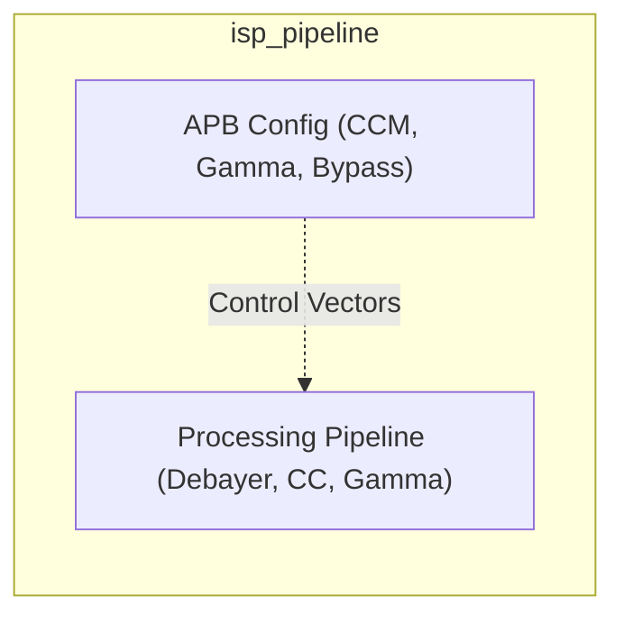
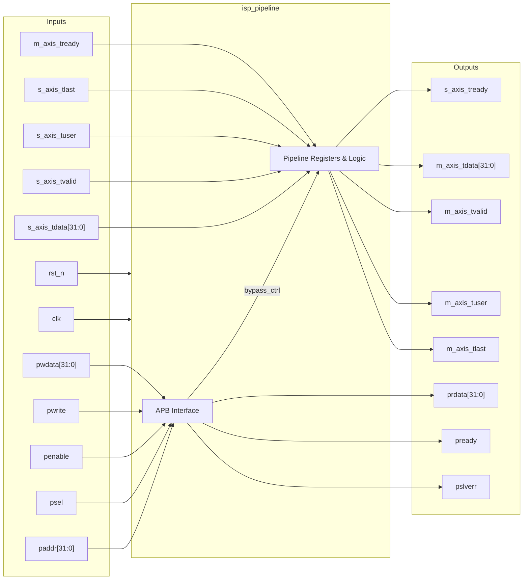

# isp_pipeline

## Description

The `isp_pipeline` module acts as the Image Signal Processor for the SMVDU-TITAN-X SoC. Placed primarily between a MIPI CSI-2 receiver and Video DMA storage, it processes raw camera feeds. Key conceptual stages of this pipeline include Debayering (Bayer to RGB interpolation), Color Correction using a 3x3 matrix, and Gamma Correction using Lookup Tables (LUT). It receives and transmits streams via AXI4-Stream interfaces and can be tuned or bypassed altogether via an APB configuration interface. 

## Interface

### Inputs

| Signal | Width | Description |
|--------|-------|-------------|
| clk | 1 | System clock |
| rst_n | 1 | Active-low asynchronous reset |
| s_axis_tdata | 32 | AXI4-Stream incoming video data |
| s_axis_tvalid | 1 | AXI4-Stream incoming valid |
| s_axis_tuser | 1 | AXI4-Stream user signal - Indicates Start of Frame (SOF) |
| s_axis_tlast | 1 | AXI4-Stream last signal - Indicates End of Line (EOL) |
| m_axis_tready | 1 | AXI4-Stream downstream ready - Indicates readiness to accept processed data |
| paddr | 32 | APB address bus |
| psel | 1 | APB select |
| penable | 1 | APB enable |
| pwrite | 1 | APB write access |
| pwdata | 32 | APB write data bus |

### Outputs

| Signal | Width | Description |
|--------|-------|-------------|
| s_axis_tready | 1 | AXI4-Stream upstream ready - Indicates module can accept new data |
| m_axis_tdata | 32 | AXI4-Stream processed output video data |
| m_axis_tvalid | 1 | AXI4-Stream output valid |
| m_axis_tuser | 1 | AXI4-Stream output user signal (SOF) |
| m_axis_tlast | 1 | AXI4-Stream output last signal (EOL) |
| prdata | 32 | APB read data bus |
| pready | 1 | APB ready |
| pslverr | 1 | APB slave error |

## Functionality

The ISP Pipeline implements configurable processing stages. Internal state is modified by the APB bus, allowing dynamic tuning of color correction matrices (CCM), gamma lookups, or global bypass capabilities (`bypass_ctrl`). The AXI4-Stream data handling includes a registered pipeline that propagates frame framing metadata (`tuser`, `tlast`) alongside the pixel data (`tdata`). In the current mock implementation, bypassing copies raw data verbatim, while processing acts as a simple pixel inversion. A complete implementation builds line buffers and matrix multipliers here for authentic image tuning. Backpressure is natively handled by integrating `m_axis_tready` into the upstream `s_axis_tready` logic.

## Hierarchical Block Diagram

## Signal-Level Diagram

