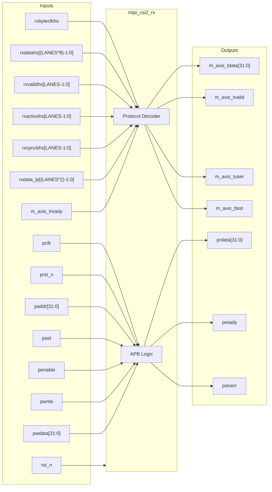

# mipi_csi2_rx

## Description

The `mipi_csi2_rx` module is the MIPI CSI-2 Receiver intended for the SMVDU-TITAN-X SoC. It captures high-speed serial data via the D-PHY interface from external camera sensors. Internally, the receiver decodes the protocol, unpacks pixels from multiple lanes, monitors link status, and formats the output into a standardized AXI4-Stream video bus to feed downstream modules like the Image Signal Processor (ISP) or Video DMA. APB interfaces provide real-time configuration and status reporting capabilities.

## Interface

### Inputs

| Signal | Width | Description |
|--------|-------|-------------|
| rst_n | 1 | Active-low asynchronous reset |
| rxbyteclkhs | 1 | High-speed byte clock from the D-PHY layer |
| rxdatahs | LANES*8 | High-speed lane data |
| rxvalidhs | LANES | High-speed valid indications per lane |
| rxactivehs | LANES | High-speed active assertions per lane |
| rxsyncbhs | LANES | High-speed sync byte assertions per lane |
| rxdata_lp | LANES*2 | Low-power lane data interface (LP-11, LP-01, etc.) |
| m_axis_tready | 1 | AXI4-Stream ready - Downstream module can accept pixels |
| pclk | 1 | APB clock |
| prst_n | 1 | APB reset |
| paddr | 32 | APB address bus |
| psel | 1 | APB select |
| penable | 1 | APB enable |
| pwrite | 1 | APB write access |
| pwdata | 32 | APB write data bus |

### Outputs

| Signal | Width | Description |
|--------|-------|-------------|
| m_axis_tdata | 32 | AXI4-Stream output pixel data |
| m_axis_tvalid | 1 | AXI4-Stream output valid |
| m_axis_tuser | 1 | AXI4-Stream user signal (Start of Frame) |
| m_axis_tlast | 1 | AXI4-Stream last signal (End of Line) |
| prdata | 32 | APB read data bus |
| pready | 1 | APB ready |
| pslverr | 1 | APB slave error |

## Functionality

The receiver features an APB slave in the `pclk` domain that exposes basic configuration (`control_reg`) and link status (`status_reg`). The core unpacking operation relies on the D-PHY `rxbyteclkhs` domain. The module monitors `rxvalidhs` from the D-PHY. Upon validating active high-speed transfers, a protocol decoder (currently stubbed) extracts byte information (`rxdatahs`) from the parallelized lanes. It tracks payload structures like Start of Frame and End of Line through underlying CSI-2 packets, passing this forward on the output AXI4-Stream side using `m_axis_tuser` and `m_axis_tlast` markers.

## Hierarchical Block Diagram

## Signal-Level Diagram

