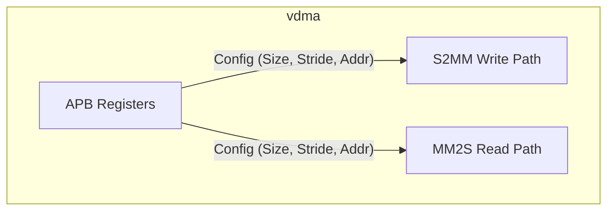
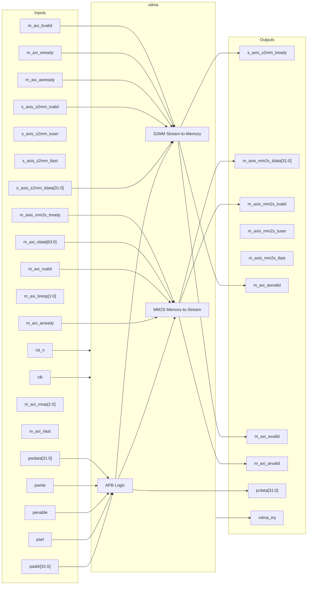

# vdma

## Description

The `vdma` (Video DMA) module is an essential component of the SMVDU-TITAN-X SoC video pipeline, functioning as a high-performance bridge between AXI4-Stream video data and AXI4 memory-mapped storage (typically DDR4). It facilitates the seamless transfer of video frames in two directions: S2MM (Stream to Memory Map), capturing data from sources like the ISP, and MM2S (Memory Map to Stream), reading frames to supply display controllers like HDMI. The design supports advanced video features such as triple buffering to prevent screen tearing and 2D transfer configurations (stride/pitch) to handle various image resolutions and cropping. Configuration is managed via an APB slave interface.

## Interface

### Inputs

| Signal | Width | Description |
|--------|-------|-------------|
| clk | 1 | System clock |
| rst_n | 1 | Active-low asynchronous reset |
| s_axis_s2mm_tdata | 32 | AXI4-Stream incoming video data (Write Channel) |
| s_axis_s2mm_tvalid | 1 | AXI4-Stream incoming valid |
| s_axis_s2mm_tuser | 1 | AXI4-Stream user signal (Start of Frame) |
| s_axis_s2mm_tlast | 1 | AXI4-Stream last signal (End of Line) |
| m_axis_mm2s_tready | 1 | AXI4-Stream downstream ready (Read Channel) |
| m_axi_awready | 1 | AXI4 Master write address ready |
| m_axi_wready | 1 | AXI4 Master write data ready |
| m_axi_bvalid | 1 | AXI4 Master write response valid |
| m_axi_bresp | 2 | AXI4 Master write response |
| m_axi_arready | 1 | AXI4 Master read address ready |
| m_axi_rvalid | 1 | AXI4 Master read data valid |
| m_axi_rdata | 64 | AXI4 Master read data |
| m_axi_rresp | 2 | AXI4 Master read response |
| m_axi_rlast | 1 | AXI4 Master read last |
| paddr | 32 | APB address bus |
| psel | 1 | APB select |
| penable | 1 | APB enable |
| pwrite | 1 | APB write access |
| pwdata | 32 | APB write data bus |

### Outputs

| Signal | Width | Description |
|--------|-------|-------------|
| s_axis_s2mm_tready | 1 | AXI4-Stream upstream ready (Write Channel) |
| m_axis_mm2s_tdata | 32 | AXI4-Stream outgoing video data (Read Channel) |
| m_axis_mm2s_tvalid | 1 | AXI4-Stream outgoing valid |
| m_axis_mm2s_tuser | 1 | AXI4-Stream outgoing user signal (SOF) |
| m_axis_mm2s_tlast | 1 | AXI4-Stream outgoing last signal (EOL) |
| m_axi_awvalid | 1 | AXI4 Master write address valid |
| m_axi_awaddr | 40 | AXI4 Master write address |
| m_axi_awlen | 8 | AXI4 Master write burst length |
| m_axi_awsize | 3 | AXI4 Master write burst size |
| m_axi_wvalid | 1 | AXI4 Master write valid |
| m_axi_wdata | 64 | AXI4 Master write data |
| m_axi_wstrb | 8 | AXI4 Master write strobes |
| m_axi_wlast | 1 | AXI4 Master write last |
| m_axi_bready | 1 | AXI4 Master write response ready |
| m_axi_arvalid | 1 | AXI4 Master read address valid |
| m_axi_araddr | 40 | AXI4 Master read address |
| m_axi_arlen | 8 | AXI4 Master read burst length |
| m_axi_arsize | 3 | AXI4 Master read burst size |
| m_axi_rready | 1 | AXI4 Master read ready |
| prdata | 32 | APB read data bus |
| pready | 1 | APB ready |
| pslverr | 1 | APB slave error |
| vdma_irq | 1 | VDMA interrupt request |

## Functionality

The VDMA controller manages independent S2MM and MM2S paths. Through the APB interface, software configures vertical size, horizontal size, stride, and up to three base addresses for both channels, enabling triple-buffering logic. When operational, the S2MM path absorbs AXI4-Stream pixels, respects the video timing markers (`tuser`, `tlast`), and translates the data into efficient 64-bit AXI4 bursts written to memory. Conversely, the MM2S path reads 64-bit bursts from memory according to the configured stride and resolution, converting them back into a continuous AXI4-Stream equipped with regenerated `tuser` and `tlast` markers for downstream video IP consumption.

## Hierarchical Block Diagram

## Signal-Level Diagram

